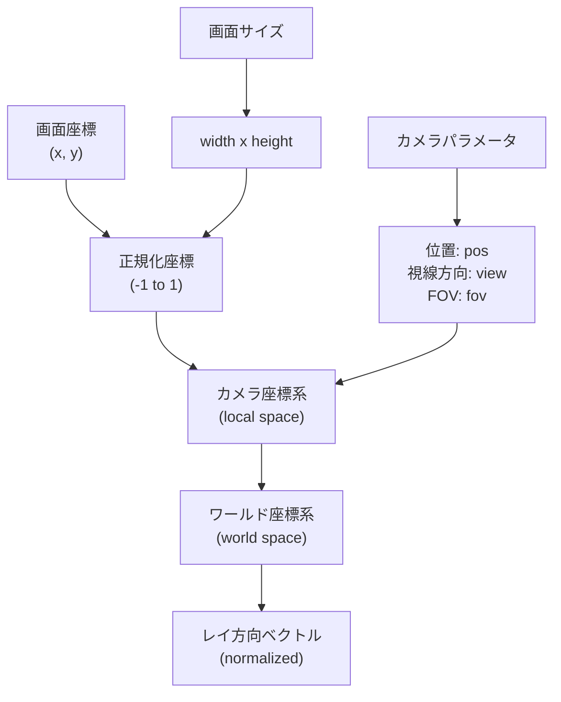

## LibminiRTについて

### ファイル構造
- 非公開APIは関数名に`int_`を付ける
- 非公開ヘッダは`internal`に格納する

### データ構造
| 要素           | 内容                                                  |
| ------------ | --------------------------------------------------- |
| **タグ列挙体**    | 各オブジェクトの種類を識別する列挙体。例：`OBJ_SPHERE`, `OBJ_PLANE`など    |
| **基底構造体**    | 共通プロパティ（マテリアル・色など）や操作（関数ポインタ）を持つ構造体                 |
| **専用構造体**    | オブジェクトごとの固有データ（位置・半径・方向など）を定義する構造体                  |
| **関数ポインタ**   | 各オブジェクト固有の処理（交差判定・メモリ解放など）を抽象化するための関数ポインタ           |
| **オブジェクト配列** | `t_object *objects[]`のように基底構造体に揃えて一括管理可能。共通ループで処理可能 |
| **拡張設計方針**   | 新しい図形（例：二次曲面）、ライト（スポットライト等）も構造体・列挙体・関数追加で柔軟に対応可能    |

### エラーハンドリング
- ユーザー操作に直接起因するもの 例）openのpathの異常 はライブラリ内で直後に処理
- そうでないもの 例）mallocに失敗 はライブラリの使用側が処理

### 使用不可関数チェックリスト
- dprintf
- atof
- strtol
- atof
- strtof
- strtod

